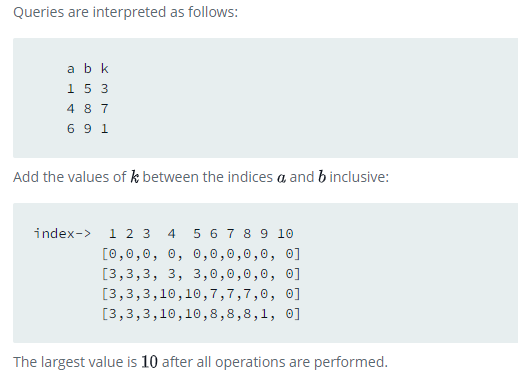

Starting with a 1-indexed array of zeros and a list of operations, for each operation add a value to each the array element between two given indices, inclusive. Once all operations have been performed, return the maximum value in the array.

# Example

n = 10

queries = [ [1,5,3], [4,8,7], [6,9,1] ]

Queries are interpreted as follows:

